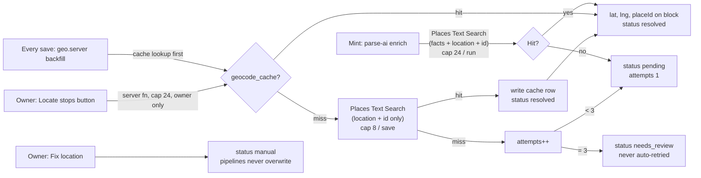

# Live Map v2 — Implementation Plan

**Status:** APPROVED by Todd 2026-09-07 (decisions 1–3 accepted; refinement: roads, walkways and quiet points of interest appear on zoom, curated in the dossier's ink). Phase 1 built in PR `feat/live-map-v2-phase1`.
**Audit basis:** `github.com/ToddStrickman/traveldoss`, `origin/main @ 28c69b1`, read 2026-09-03. Every file path below was read from that commit, not assumed.
**Author:** Claude, 2026-09-03.

---

## 0. Bottom line, in plain language

**The surprise finding: TravelDoss already has a Live Map.** It shipped in July (PR #6, then #28). Every dossier day header that has located stops shows a small "Map" pill. Tapping it opens a full-screen Google Map with numbered, day-coloured pins and a thin line per day. Coordinates are already looked up on the server when a dossier is minted and saved, and stored on each stop.

**What is missing, measured against the homepage promise** ("every place pinned, categorized, and routed by day on a live map"):

| Promise | Today | Gap |
| --- | --- | --- |
| A Map you can always reach | Only from a day header, only when that day has coordinates | No persistent entry point. Not reachable from the mobile masthead, the desktop pill cluster, or the trip library |
| "Categorized" | Every pin is the same circle with a number | No category icons, no distinction between a hotel and a museum |
| "Routed by day" | Straight lines, one colour per day | Functional but generic. Not the editorial "treasure map" feel |
| Premium feel | Default Google basemap, Roboto labels, Google POI clutter suppressed but the look is stock | Reads as an embedded Google Map |
| Pin detail | A 220px Google InfoWindow with name and time | No image, note, reservation, address, directions, or jump-to-stop |
| Reliability | If Google's key fails (it does on non-prod hosts), a keyless OpenStreetMap raster fallback draws the pins | Two renderers to maintain |
| Cost safety | Unresolved stops are re-geocoded on every save, forever, with an in-memory cache that does not survive on Cloudflare Workers | A slow cost leak on the paid Google Places tier |

**Recommendation in five lines**

1. **Keep the architecture the owner already approved in July** (one overlay owned by `SkinFrame`, opened per day from day headers) and **add one persistent Map control** in the chrome that already exists: the mobile masthead and the desktop top-centre pill cluster. No hovering button. That respects the July correction ("the map belongs to each day, not a hovering button") while meeting the new requirement.
2. **Swap the renderer from Google Maps JS to MapLibre GL JS with OpenFreeMap vector tiles.** Zero cost at any scale, no browser API key, and full control of the look, which is the only way to get an editorial map instead of a Google one. Keep Google Places on the server for geocoding, where it is already wired and where its POI recall is worth paying for.
3. **Keep coordinates on the block** (the flat `Block[]` is the source of truth, per the owner's standing ruling). Add three small fields: `placeId`, `geocode` status, `mapHidden`. Add one server-only table, `geocode_cache`, so the same place is never paid for twice across all dossiers.
4. **Build the treasure route as a dotted line in itinerary order** (day, then morning/afternoon/evening, then time, then block order), broken into per-day segments and thin arcs for long hops. Straight lines, not road routing, in v1.
5. **Ship in three phases**: foundation (renderer swap, persistent button, category pins, geocode hardening), then route and place detail, then filters, clustering, and the cross-dossier Atlas.

**Three decisions needed from Todd before any code** (detailed in §11):

1. Confirm the persistent Map control in the chrome, alongside the day-header pills.
2. Approve the renderer swap (MapLibre + OpenFreeMap) instead of staying on Google.
3. Confirm scope: the map lives inside the dossier in Phases 1–2; the cross-dossier Atlas on `/app` is Phase 3.

---

## 1. Phase 0: repository audit findings

Role stack applied: principal front-end, staff back-end, security, cost, and accessibility review. Files were read at `origin/main @ 28c69b1`.

### 1.1 What exists (and where)

| Area | Finding | File | Implication for the plan |
| --- | --- | --- | --- |
| Framework | TanStack Start (SSR) + Vite 7 + React 19 + Tailwind v4, deployed to Cloudflare Workers via Lovable. `main` is written by Lovable's bot; Claude work lands by PR. | `package.json`, `vite.config.ts`, `wrangler.jsonc` | Any new client library must be lazy-loaded (the landing entry is already ~1.2 MB). Server code cannot hold in-memory state across requests. |
| Data model | A trip is one row in `trips`; the itinerary is `content.blocks`, a flat discriminated union of 8 block kinds. `place` blocks already carry `lat`, `lng`, `address`, `category`, `time`, `note`, `images`, `reservation`, `website`, `phone`, `hours`, `mapsUrl`, `tier`, `enrichmentSource`. | `src/lib/skins/types.ts` | The map data model is 90% there. Missing: a stable block id, a Places id, a geocode status, an owner "hide" flag. |
| Existing map | `DossierMapOverlay`: fixed full-screen dialog (z-index 70), Google Maps JS via a lazy loader, numbered circle markers coloured per day, one polyline per day, day toggle chips, fit-to-bounds, Escape to close, body scroll lock. Snapshots which stops are *visible on screen* at open time via `checkVisibility()`. A keyless OpenStreetMap raster fallback (own Mercator projection, SVG route) renders when Google auth fails. | `src/components/map/DossierMap.tsx` (≈600 lines) | Keep the shell (header, chips, footer, visibility contract). Replace the map mount. The Mercator fallback is reusable as a "no tiles" parchment mode. |
| Map opener | `SkinFrame` owns one overlay and provides `openMap(day)` through `DayMapContext`. Day headers render a token-styled "Map" pill when the day has located stops. The floating button was retired by owner correction on 2026-07-13 (commit `5209e48`). | `src/lib/skins/shared/SkinFrame.tsx`, `day-map-context.ts`, `views/editing-kit.tsx:193` | The new persistent control must call the same `openMap()`; it must not be a hovering FAB. |
| Geocoding (parse) | At mint, `enrichPlacesViaWebSearch` calls Google Places Text Search (New) with a field mask that includes phone, website, hours and location: the Enterprise tier. Cap 24 per run, concurrency 4. | `src/lib/itinerary/parse-ai.functions.ts:560–640` | This is the existing ≈$0.84/dossier cost. The map adds nothing here. Add `places.id` to the mask (same tier). |
| Geocoding (save) | `enrichBlocksWithCoords` runs on every create and update: for each `place` with no `lat`, one Text Search with a location-only mask (Pro tier). Cap 8 per save, 3 s timeout, 3 s budget, 24 h in-memory cache. Never throws. | `src/lib/itinerary/geo.server.ts`, `trips.functions.ts:73, :203` | Two defects: (a) the cache is per Worker isolate, so in production it is close to a no-op; (b) a stop that never resolves is retried on every save, forever. |
| Location suggest | `suggestLocation` (auth-gated) uses the same Places endpoint, anchored to neighbouring stops. | `src/lib/itinerary/suggest-location.functions.ts` | Reuse for the owner's "fix this pin" search. |
| Harden pipeline | Three refine passes, each a full AI parse plus up to 24 Places lookups. The archetype gap analysis (2026-08-03) found refine/harden destroys block detail not carried by the AI schema. | `src/lib/itinerary/harden.functions.ts` | **Blocker to verify in Phase 1:** whether `lat`/`lng` and the new fields survive refine and harden. If not, every refine erases the map. |
| Categories | Canonical six (`transit`, `restaurant`, `walk`, `event`, `accommodation`, `culture`) plus legacy aliases (`stay`, `eat`, `see`, `do`, `drink`, `other`, `hotel`, `airfare`, `currency`, `walking`, `food`). Stroke-only 24×24 SVG icons exist for each. Editors expose the canonical six. | `types.ts:60–75`, `src/lib/skins/shared/CategoryIcon.tsx`, `ActivityEditSheet.tsx:23`, `editing-kit.tsx:540` | The pin icon system reuses these icons. Adding categories touches five files plus three AI schemas; defer. |
| Dead schema | A `places` table (with `lat`, `lng`, `google_place_id`, `category` enum) exists but has zero readers. PR #51 drops it. | `supabase/migrations/20260529194116…sql`, PR #51 | Do not resurrect it. Merge #51 before Phase 1 so new tables do not collide with dead ones. |
| Chrome, dossier mobile | Fixed top masthead (56 px, z-50, `md:hidden`): back, title, save state, view pill, **Days**, lock, share. Bottom: `ExportMenu` (right), `StudioBar` when editing. | `src/components/mobile/DossierMastheadBar.tsx` | Map control slot: next to **Days**. |
| Chrome, dossier desktop | Fixed: back pill (top-left, z-50), `ViewSwitch` pills (top-centre, z-50), `TemplateMenu` (top-right), `EditingStatusBar`, `ExportMenu` (bottom-right), `StudioBar` (bottom-centre, editing), gallery button. | `t.$slug.tsx:690–850`, `ViewSwitch.tsx` | Map control slot: a fourth segment on the top-centre pill cluster. |
| Chrome, workspace | `Ribbon` (left rail, md+) and `MobileNavBar` (bottom pill, <md) on landing, templates, guides, and `/app`. Dossier pages deliberately omit both. Owner direction in the Ribbon source: "an option that doesn't exist shouldn't be present". | `src/components/landing/Ribbon.tsx`, `mobile/MobileNavBar.tsx` | A Map rail item on `/app` appears only when the cross-dossier Atlas exists (Phase 3). |
| Shareable state | `?view=` and `?gallery=N` search params are the established pattern for deep links. | `t.$slug.tsx:46–52`, `CoverflowGallery.tsx:456` | `?map=trip` / `?map=day-2` follows it and gives the browser back button and share links for free. |
| Mobile primitives | `TdSheet` (vaul drawer, branded) and `PlaceSheet` (tap a stop on a coarse pointer: Open in Maps, Call, Website, Copy address). | `src/components/mobile/TdSheet.tsx`, `PlaceSheet.tsx` | The mobile place detail is `PlaceSheet` extended, not a new component. |
| Skins | 11 skins; 6 light paper, 5 dark (`calliope`, `marcello`, `orsino`, `solveig`, `vesper`). No runtime dark toggle: "dark mode" is skin polarity. Tokens: `bg`, `ink`, `inkSoft`, `accent`, `rule`, fonts. | `src/lib/skins/*.tsx`, `styles.css` | The map style must be generated from tokens per skin, with a light and a dark recipe. |
| Analytics | `capture(event, props)` fans out to PostHog and GA4 with `object_verb` snake_case names, counts only, never slugs. Lovable's admin console plan lists "map" as a tracked feature. | `src/lib/analytics.ts`, `docs/analytics/tracking-plan.md`, `.lovable/plan.md` | Events in Appendix B. |
| Offline | PWA precaches built assets; runtime caches HTML, fonts, images. No tile caching. | `vite.config.ts` | Offline map is a future item; vector tiles make it possible, Google's terms do not. |
| Keys | `GOOGLE_MAPS_API_KEY` (server) and `VITE_LOVABLE_CONNECTOR_GOOGLE_MAPS_BROWSER_KEY` (browser, referrer-restricted). | `.env.example` | MapLibre + OpenFreeMap needs no browser key. The server key stays for Places. |
| Tests | `bun test src tests` (290 passing at last count), Playwright e2e, dev harness `/e2e/dossier` with a Lisbon fixture that has 10 located stops. | `tests/`, `e2e/`, `src/routes/e2e.dossier.tsx`, `src/lib/skins/demo.ts` | Every phase verifies on the harness first, then on iOS Safari (owner's gating browser). |
| Bundle trap | `"sideEffects": false` in `package.json` has previously dropped side-effect-only imports from the client bundle. | memory: Sentry trap | Import MapLibre as a used default import; inline the handful of MapLibre CSS rules into `skin.css` rather than importing the library stylesheet. |

### 1.2 What is missing entirely

- No stable identity on blocks. A stop is "block index 17". Indexes shift on edit. Fine for a map rebuilt from blocks on every open (Phases 1–2). Not fine for a persisted cross-dossier index (Phase 3 prerequisite).
- No Google Place ID stored, so duplicates cannot be detected reliably and Place Details can never be fetched later.
- No geocode status, attempt count, or "needs review" state. "No coordinates" and "tried three times and failed" look identical.
- No owner correction path. If the geocoder puts a restaurant in the wrong city, nothing in the UI can fix it.
- No place detail beyond name and time.

### 1.3 Things I could not verify from the repository (owed in Phase 0 close-out)

| Item | Why it matters | How to verify |
| --- | --- | --- |
| Does the Google map actually render on traveldoss.com, or does every visitor see the OSM fallback? | Decides whether the current experience is "Google map" or "raster fallback" today | Open any public dossier on prod, tap a day's Map pill, check the network for `maps.googleapis.com` and for `gm_authFailure` in the console |
| Which `place` fields survive `refine` and `harden` | If `lat`/`lng` are stripped, the map empties after any refine | Run refine on the `/e2e/dossier` fixture with `?edit=1`; diff blocks before and after |
| How many stored dossiers have stops without coordinates | Sizes the one-time backfill and its Places cost | SQL: count `jsonb_array_elements(content->'blocks')` where `kind='place'` and `lat` is null |
| Exact current Google Places SKU tiers and free quotas | The cost table in §3 uses September 2026 third-party summaries | Read the live pricing page once; the plan's caps are conservative either way |

---

## 2. Persistent access to the Map (Requirement 1)

### 2.1 Interaction model: full-screen overlay, deep-linked. Not a route, not a modal card.

| Option | Verdict | Why |
| --- | --- | --- |
| **Overlay inside the dossier route, synced to `?map=`** (recommended) | ✅ | The dossier route already holds edit state, undo history, autosave, skin tokens and the block list. An overlay reads all of it for free. Return-to-context is automatic: the page underneath does not unmount, so scroll position and edit state survive. It is what the owner approved in July, made reachable. |
| Dedicated route `/t/$slug/map` | ❌ | Would re-fetch the dossier or lift 860 lines of state out of `t.$slug.tsx`. Navigating away loses scroll position and the editing session. Two routes to keep in sync when Lovable edits one of them. |
| Modal card / popover map | ❌ | Too small for a route across a city. The map is a primary view, not a widget. |
| Docked split view (map right, dossier left) | ⏩ Phase 3 desktop option | Strong fit for the "desktop = Mission Control" archetype. Needs the overlay to exist first; the same `MapCanvas` docks into a panel. |

**Deep link.** `?map=trip` opens the whole trip; `?map=day-2` opens focused on day 2. Opening pushes history; closing pops it, so the browser back button closes the map. Sharing a link with `?map=day-2` opens the recipient straight onto that day's route. This mirrors the existing `?view=` and `?gallery=N` patterns.

### 2.2 Placement

| Surface | Where | Behaviour |
| --- | --- | --- |
| Mobile (<768 px), any dossier view, read or edit | The masthead bar, a fourth icon-button next to **Days** | 44 px tap target, `MapPinned` outline icon, label "Map" at `xs:` and up. Visible whenever the trip has at least one located stop, or the viewer is the owner (owners see it with a "locate stops" empty state so they can fix a trip with no pins). |
| Desktop (≥768 px) | A fourth segment on the top-centre `ViewSwitch` pill: `vertical · horizontal · grid │ ⌖ map`, separated by a hairline | Same fixed pill, same tokens. The map is a *lens* on the same content, so it sits with the other lenses. Never obstructs the back pill, template menu, or export menu. |
| Day headers (all three views) | Existing "Map" pill stays | Opens the same overlay focused on that day. Nothing changes here. |
| Inside the overlay | Header close button, Escape, browser back | All three close and restore context. |
| Owner's expired dossier | Same | The owner still has full content. |
| Trip library `/app` | Rail item "Atlas" | **Phase 3 only.** Until the cross-dossier map exists, no button, per the owner's "an option that doesn't exist shouldn't be present" rule. |
| Landing, templates, guides | None | Nothing of the user's to map. Guides already have the 3D globe. |

**Sticky behaviour.** Both chrome slots are already `position: fixed` with safe-area padding, so the button is always on screen without new layout work. On mobile the masthead is 56 px; the button adds no height.

**Visual priority.** Secondary to Compose and the view switcher, equal to Days. Ink at 70% opacity, accent on hover and when the map is open (`aria-pressed`). No badge, no pulse.

**Iconography.** `MapPinned` from lucide (already the icon set for chrome). Not the `MapPin` used inside day pills, so the global control and the per-day control read differently.

**Accessibility.** `<button aria-haspopup="dialog" aria-expanded aria-controls="live-map">`. The overlay is `role="dialog" aria-modal="true"` (exists) and gains a focus trap and focus return to the opener (missing today). Escape closes (exists).

**Responsive.** Overlay uses `100dvh`, safe-area insets, and a bottom sheet for detail on mobile, a side panel on desktop (§7).

---

## 3. Free or low-cost mapping stack (Requirement 2)

### 3.1 The recommendation table

Free-tier numbers are from September 2026 sources (listed in Appendix C). Google's SKU tiers are labelled "verify" because the per-field tier table on Google's own docs could not be read this session; the caps in the plan are conservative regardless.

| Capability | Recommended option | Why it fits | Free-tier considerations | Risks or limitations | Backup option |
| --- | --- | --- | --- | --- | --- |
| Map rendering and interaction | **MapLibre GL JS v6** (BSD, ~250 KB gz, lazy-loaded on first open) | Full style control from a JSON style: parchment ground, hairline roads, ink coastlines, no POI clutter. Native dashed lines, GeoJSON sources, clustering, HTML markers, `fitBounds`, WebGL rendering that stays smooth with 100+ pins. Same API family as Mapbox GL. | Free forever, no key, no telemetry. | v6 requires WebGL2 (dropped WebGL1 in July 2026). Detect and fall back to the parchment SVG mode. ESM only, which Vite handles. | Keep the existing Google Maps JS overlay code as-is until parity is proven; delete after. |
| Base-map tiles | **OpenFreeMap** public instance (vector tiles, OSM-derived, weekly updates) with a **TravelDoss style JSON** generated from skin tokens | No registration, no key, no limits, explicit commercial use allowed. Vector tiles mean the *same* tiles restyle per skin at runtime. | Free without quota. | Run by one maintainer; no SLA. Mitigation: the style's `sources.url` is one string; Phase 3 self-hosts Protomaps PMTiles on Cloudflare R2 (the app already lives on Cloudflare) so a swap is a config change. | Protomaps PMTiles on R2 (self-hosted, ~free at this scale); paid MapTiler Flex or Stadia Starter (≈$20–29/month) if ops time is worth more than the fee. |
| Geocoding (name or address → lat/lng) | **Google Places Text Search (New), server-side** (already wired in three files) with `places.id` added to the mask, a Supabase `geocode_cache` table, and a three-attempt cap | Best POI recall for the queries this product makes ("Belcanto, Lisbon", "Memmo Príncipe Real"). Already pays for itself in the parse enrichment that also fills phone, hours, website. | Location-only mask (Pro tier): 5,000 free/month then ≈$32 per 1,000 (verify). Full-fact mask at parse (Enterprise): 1,000 free/month then ≈$35 per 1,000 (verify). | Cost per miss if retries are unbounded (fixed by the cap). Google terms prohibit storing most Places data long-term, **except** `place_id`, which may be stored indefinitely; lat/lng stored on the block is the app's own derived itinerary data and is already the shipped practice. | Photon (komoot, free, Apache-2, fair use) for address-only strings when the Google key is absent or the monthly budget is hit. Nominatim's public instance is 1 request/second and forbids bulk use, so it is not a product dependency. |
| Reverse geocoding | **None in v1** | Nothing starts from coordinates. "Current location" (Phase 3) only needs a dot on the map, not an address. | n/a | n/a | Photon `/reverse` or Google Geocoding (Essentials: 10,000 free/month) if a "what's near me" feature appears. |
| Marker clustering | **MapLibre native clustering** (`cluster: true` on the GeoJSON source) for the Atlas; **screen-space nudge** for the per-dossier map | An itinerary is 10–60 stops; clustering would hide the route. Overlaps (two stops in one building) get a 12 px radial offset and a "2" badge instead. Cross-dossier Atlas (hundreds of pins) uses real clusters with day-agnostic counts. | Built in, free. | HTML markers do not participate in MapLibre's collision engine; above ~80 visible markers switch to a symbol layer with a sprite (Phase 3). | supercluster (the library MapLibre uses internally) if custom cluster rendering is needed. |
| Route or line rendering | **GeoJSON `LineString` per day on a `line` layer** with `line-dasharray` for the dotted look and a paper-coloured halo layer beneath; **great-circle arcs** (`@turf/great-circle` or a 40-line helper) for long hops | Vector lines stay crisp at every zoom, dash spacing is in pixels so dots never smear, and per-day opacity is one `setPaintProperty` call. | Free. | Straight lines are not walking routes and must not pretend to be (§5.3). | Road/walking routing in Phase 3 via Google Routes API (Compute Routes Essentials, 10,000 free/month, verify) or OpenRouteService, cached on the day block. |
| Storing and caching coordinates | **On the `place` block** (`lat`, `lng`, `placeId`, `geocode`) as today, plus **`geocode_cache`** (server-only table keyed by normalised query hash) | The block is the owner-ruled source of truth. The cache turns "geocode Belcanto for the fifth dossier this month" into a free row read and survives Worker restarts. | Supabase free tier is ample; one row per distinct query. | None material. | Cloudflare KV for the cache if Supabase latency from the Worker becomes visible (it will not at this scale). |

### 3.2 Head-to-head: the seven candidates

| Candidate | Commercial use on the free tier | Cost after free | Look and feel control | Offline possible | Notes |
| --- | --- | --- | --- | --- | --- |
| **MapLibre GL JS** (library) | Yes, BSD | $0 | Total (JSON style, runtime restyle per skin) | Yes (PMTiles) | Renderer only; needs a tile source below. **Recommended.** |
| **Leaflet** (library) | Yes, BSD | $0 | Raster only unless plugins; styling means picking a tile provider's style | Partial | Simpler, lighter (~40 KB), but the "editorial map" brief is a vector-styling brief. Leaflet cannot recolour a road. Loses on aesthetics. |
| **OpenStreetMap raster tiles** (`tile.openstreetmap.org`) | Tolerated only at low volume; the usage policy forbids heavy or bulk use by apps | $0 | None (fixed cartography) | No | What the current fallback uses. Acceptable as an emergency fallback, not as a primary. |
| **OpenFreeMap** (vector tiles) | Yes, explicitly | $0 | Total, via MapLibre | Yes, via self-host | No SLA. **Recommended primary source**, with the R2 self-host as the planned hedge. |
| **MapTiler Cloud** | **No.** Free plan is non-commercial and R&D only | Flex from ≈$29/month | Total (their styles or custom) | Yes | TravelDoss sells dossiers, so the free plan is not usable in production. Good paid backup: maps stop rather than bill on overage. |
| **Stadia Maps** | **No.** Free plan is non-commercial | Starter ≈$20/month | Total (MapLibre-compatible styles) | Yes | Same story as MapTiler. Good paid backup, especially for routing (Valhalla) later. |
| **Google Maps Platform** (current) | Yes | Dynamic Maps: 10,000 loads/month free, then ≈$7 per 1,000 | Moderate (Cloud styling recolours features; cannot change label fonts, add texture, or remove the Google feel) | **No** (terms forbid caching tiles) | Loads are counted per *open*, including recipients of shared links. A single dossier that goes viral, or a scraped browser key, bills the account. Two SDK loads (maps + marker) on open. Deprecated `Marker` class in use today. |
| **Mapbox** | Yes, up to 50,000 loads/month (verify) | ≈$5 per 1,000 | Total (Studio) | Restricted by terms | MapLibre is its open fork with the same API. Paying Mapbox buys Studio's UI, which a token-generated style makes unnecessary. |

### 3.3 The call, and what would change it

**Initial version: MapLibre GL JS v6 + OpenFreeMap vector tiles + a token-generated TravelDoss style. Google Places stays server-side for geocoding.**

Why it wins:

- It is the only combination that is free at any scale *and* allowed for a paid product *and* able to look like TravelDoss rather than like Google.
- It removes the browser API key, the referrer-restriction failure mode, and the second (OSM raster) renderer. One renderer, one code path.
- It makes the offline promise on the landing page technically honest later (vector tiles for a trip's bounding box are a few megabytes and cacheable; Google's are not).

Why the alternatives lose:

- Google: costs money past 10,000 opens a month with no ceiling, cannot escape the stock look, cannot go offline, and the current implementation already needed a fallback because the key fails outside production.
- Leaflet: cannot restyle roads and water; the brief is an aesthetic brief.
- MapTiler and Stadia: excellent products, but their free tiers exclude commercial use, so they are paid options, not free ones.

What would justify switching later:

- **To self-hosted Protomaps on R2:** OpenFreeMap outages observed in Sentry more than once a quarter. Planned for Phase 3 regardless.
- **To paid MapTiler or Stadia:** if self-hosting proves to cost more engineering time than ≈$25/month.
- **Back to Google or to Mapbox:** only if the product needs Street View, live traffic, or Google's transit routing inside the map. None is in the archetype research.

Confidence: high on the library choice, medium-high on OpenFreeMap as the primary source (mitigated by the one-line source swap).

---

## 4. Dossier-to-map data model (Requirement 3)

### 4.1 Principle

The flat `Block[]` in `trips.content` stays the single source of truth (owner ruling, 2026-08-04: "Do not re-derive this"). The map reads a **derived, in-memory projection** built by a pure function. Nothing about the map is persisted anywhere else in Phases 1–2. Phase 3 adds a **derived index table** for cross-dossier queries, refreshed on save, never edited directly (the same relationship the memory graph has to the memory wiki).

### 4.2 Which dossier fields become map locations

| Block kind | Becomes a pin? | Notes |
| --- | --- | --- |
| `place` with `lat`+`lng` | **Yes** | The only pin source. Category, day, part-of-day, time, note, images, reservation, contact fields all come along. |
| `place` without coordinates | Counted as "unlocated", listed in the footer, offered to the owner for locating | Never guessed on the client. |
| `place` with `tier: "shadow"` (Plan B) | Yes, as a ghost pin, off by default | Excluded from the route. |
| `place` before the first `day` (preface: hotel, currency desk) | Yes, styled as a **base** pin | Not on the day route; drawn as the anchor the day routes leave from and return to when it is an accommodation. |
| `flight` | **No pin.** Draws the long-hop arc between the `fromCity` and `toCity` stops if both have located places nearby | Airports are not itinerary places; the arc says "you fly here". |
| `day` | Not a pin. Supplies day number, label, date, and day images (the hero image for a day's route) | |
| `section` (`partOfDay`) | Not a pin. Supplies ordering | |
| `hero`, `paragraph`, `quote`, `note`, `gallery` | No | |

### 4.3 Schema additions (adapted to the repository's conventions)

Additions to the `place` variant in `src/lib/skins/types.ts`. Every field optional so no existing dossier changes shape.

```ts
// src/lib/skins/types.ts — `place` block, new optional fields
{
  kind: "place";
  // …existing fields, including lat?: number; lng?: number; …

  /** Google Places resource id (places.id). The one Places datum Google
   *  permits storing indefinitely. Enables dedupe and future Place Details. */
  placeId?: string;

  /** Geocoding lifecycle. Absent = never attempted (legacy dossiers). */
  geocode?: {
    status: "resolved" | "pending" | "needs_review" | "failed" | "manual";
    provider?: "google-places" | "photon" | "manual";
    /** Bounded: after 3 failed attempts the stop becomes needs_review and is
     *  never auto-retried again. Owner actions reset it. */
    attempts: number;
    /** The text that was sent, shown to the owner in "needs review". */
    query?: string;
    /** ISO timestamp of the last attempt or the manual fix. */
    at?: string;
  };

  /** Owner chose "don't show this on the map" (e.g. a private address). */
  mapHidden?: boolean;
}
```

Derived projection (never persisted in Phases 1–2), in a new pure module `src/lib/maps/build-map-places.ts`:

```ts
export type MarkerKind =
  | "stay" | "dine" | "drink" | "culture" | "walk" | "event" | "transit" | "other";

export type GeocodeStatus = "resolved" | "pending" | "needs_review" | "failed" | "manual";

export type MapVisit = {
  blockIndex: number;
  day: number | null;          // null = preface / trip essentials
  date?: string;               // from the day block
  part?: "morning" | "afternoon" | "evening";
  time?: string;               // "08:30"
  order: number;               // 1-based order within the day's route
};

export type MapPlace = {
  /** `${tripId}:${firstBlockIndex}` until blocks carry ids (Phase 3). */
  key: string;
  tripId: string;
  tripSlug: string;
  name: string;
  kind: MarkerKind;            // from the taxonomy in §6
  rawCategory?: string;        // the block's own category value
  address?: string;
  lat: number;
  lng: number;
  placeId?: string;
  tier: "primary" | "shadow";
  isBase: boolean;             // accommodation, or any preface stop
  note?: string;
  imageUrl?: string;           // first block image, else first day image
  website?: string;
  websiteTitle?: string;
  phone?: string;
  hours?: string;
  reservation?: string;
  mapsUrl?: string;
  geocodeStatus: GeocodeStatus;
  source: "parse" | "backfill" | "manual";
  /** One pin, many visits: the same restaurant on Day 1 and Day 4. */
  visits: MapVisit[];
};

export type MapRouteSegment = {
  day: number;
  kind: "walk" | "hop";        // hop = consecutive stops > 150 km apart
  coordinates: [number, number][];
  fromKey: string;
  toKey: string;
};

export type MapModel = {
  places: MapPlace[];
  segments: MapRouteSegment[];
  unlocated: Array<{ blockIndex: number; name: string; status: GeocodeStatus }>;
  days: number[];
  bounds: [[number, number], [number, number]] | null;
};

export function buildMapModel(trip: TripView, blocks: Block[], opts?: { onlyVisible?: Set<number> }): MapModel;
```

### 4.4 Relationships

| Relationship | How it is expressed |
| --- | --- |
| Place → dossier | `tripId` / `tripSlug` on the projection; on disk, containment in `trips.content.blocks` |
| Place → itinerary day | `visits[].day`, from `buildItinerary()` (`src/lib/skins/shared/itinerary.ts`) which already assigns every place to a day and a part-of-day |
| Place → city | Phase 1: none (the trip's `destination`). Phase 3: `city`/`country` from Place Details (`addressComponents`) at geocode time, stored on the block |
| Place → category | `kind` via the taxonomy module (§6) |
| Place → user | Through the trip's `user_id`. Never on the public payload. |
| One dossier → many locations | Trivial: many `place` blocks |
| Same location in many entries | `visits[]` (see 4.5) |

### 4.5 Duplicate pins

Group key, in priority order: `placeId` → rounded `lat,lng` to 4 decimals (≈11 m) + normalised name → exact `lat,lng`. One `MapPlace`, many `visits`. The pin shows the first visit's order badge; the detail lists every visit ("Day 1 · 20:00 · Dinner" and "Day 4 · 13:00 · Lunch"). The route still passes through the pin on each visit. Across dossiers (Atlas, Phase 3) the same key groups across trips and the detail lists the dossiers.

### 4.6 Address but no coordinates, ambiguous names, invalid results, manual corrections

| Situation | Handling |
| --- | --- |
| Address, no coordinates | Save-time backfill (exists) resolves it with the address as the query. Now cached and capped. |
| Name only, no address | Query `"${name}, ${destination}"` (exists). |
| Ambiguous name ("The Market") | Phase 2: anchor the query to the neighbouring stops the way `suggestLocation` already does. Phase 2 also checks the result's distance from the trip's other located stops: a hit more than 300 km from the day's median is marked `needs_review`, not resolved. |
| Google returns nothing or an error | `attempts++`. At 3, `status: "needs_review"`. Never retried automatically. The footer count and the owner's detail panel show it. |
| Owner correction | In edit mode the detail panel offers **Fix location**: drag the pin, or search (reuses `suggestLocation`). Writes `lat`, `lng`, `placeId` (if searched), `geocode.status: "manual"`, `enrichmentSource: "manual"`. Manual coordinates are never overwritten by any pipeline. |
| Owner hides a pin | `mapHidden: true`. Still in the itinerary, not on the map. |
| Owner deletes the stop | Ordinary block delete; nothing map-specific. |

### 4.7 Where coordinates are stored, and how geocoding runs

**Stored:** on the block, as today. Not in a separate table until Phase 3's derived index.

**Trigger, cache, retry, review:**



**Client-side, server-side, or background job?** Server-side only, on the existing request path (parse and save), plus an owner-triggered server function. Reasons: the key must never reach the browser; Cloudflare Workers has no scheduler in this project other than `pg_cron` (SQL only, cannot call Google); the volumes (≤24 lookups per event) fit comfortably inside a request with the existing timeouts. A background job is not needed at this scale and would add a queue to operate.

**`geocode_cache` table (Phase 1 migration):**

```sql
create table public.geocode_cache (
  query_hash  text primary key,             -- sha256 of the normalised query
  query       text not null,
  lat         double precision,
  lng         double precision,
  place_id    text,
  provider    text not null,                -- 'google-places' | 'photon'
  resolved_at timestamptz not null default now(),
  miss_count  int not null default 0        -- misses are cached too (7 days)
);
grant all on public.geocode_cache to service_role;
alter table public.geocode_cache enable row level security;
-- No policies for authenticated or anon: server-only, read through supabaseAdmin.
```

This replaces the in-memory `Map` in `geo.server.ts`, which cannot be shared between Worker isolates and is therefore mostly cold in production.

---

## 5. Visual design and the treasure-map route (Requirement 4)

### 5.1 Direction: "The Cartographer's Plate"

The map is a printed plate bound into the dossier, not a window onto Google. It takes its paper, ink, hairline and accent from the active skin, so the same Lisbon trip looks like an engraved plate in *marguerite* and like a chart on a night table in *vesper*. The basemap is quiet to the point of being furniture; the dossier's own pins and route are the only things with colour.

This is the screen-native translation of the owner's material brief (stone, glass, fine leather; "something that lives in a digital screen should act as such"): depth from light and hairlines, not from textures pretending to be paper.

### 5.2 Palette and base-map style (generated per skin from `SkinTokens`)

| Layer | Light skins (paper `bg`, dark `ink`) | Dark skins (dark `bg`, light `ink`) |
| --- | --- | --- |
| Ground (land) | `bg` | `bg` |
| Water | `color-mix(bg 93%, ink)` | `color-mix(bg 88%, ink)` (water darker than land, as on a night chart) |
| Parks, green | `color-mix(bg 95%, accent)` | `color-mix(bg 94%, accent)` |
| Coastline, rivers | 0.6 px, `ink` at 30% | 0.6 px, `ink` at 22% |
| Motorways / major roads | 1 px, `ink` at 16% | 1 px, `ink` at 14% |
| Minor roads (z ≥ 14) | 0.5 px, `ink` at 9% | 0.5 px, `ink` at 8% |
| Buildings (z ≥ 15) | fill `ink` at 3% | fill `ink` at 4% |
| Rail | 0.8 px dashed [4, 3], `ink` at 18% | same |
| Basemap POI icons and names | **hidden** | **hidden** (the brief: only the user's places) |
| District / neighbourhood labels | `ink` 55%, uppercase, letter-spacing 0.18em, 10–11 px (mirrors `.tds` meta type) | same |
| Street names (z ≥ 15) | `ink` 45%, 10 px | same |
| Grain | The app's existing `td-grain` overlay at 2% over the canvas, `pointer-events: none` | same |
| Vignette | 8% `ink` edge vignette so the plate reads as bound into the page | same |

Fonts: OpenFreeMap serves glyph PBFs for Noto Sans, which is what labels use in Phases 1–2. Phase 3 self-hosts glyphs generated from the skin's body face so labels match the dossier's typography.

### 5.3 The route

| Property | Value |
| --- | --- |
| What it connects | Located primary stops of one day, in route order. Plan B stops never. Preface base (hotel) is drawn as a faint "leash" from the first and last stop of each day when it is within 25 km. |
| Geometry | **Straight lines between stops in v1.** A dotted treasure line is a diagram of intent, not directions, and the design must say so: the legend line reads "Route · in itinerary order". Road, walking, and transit routing are a Phase 3 toggle drawn in a *different* style (§5.5). |
| Ordering when dates and times exist | Day (`day.n`) → part of day (morning, afternoon, evening from `buildItinerary`) → parsed time (`slots.ts` `hourOf`) → block order. Dates only order days when `day.n` is missing, which the parser never emits. |
| Ordering when times are missing | Block order within the part. Untimed stops already bucket to morning by `bucketFor`, so the route is still deterministic. Nothing is guessed from geography. |
| Colour | Skin `accent` at 70%. One colour for the whole trip; days are distinguished by chips and focus, not by ten competing hues (today's `DAY_COLORS` palette is retired: it fights every skin). |
| Width and dots | 2 px, `line-dasharray: [0, 2.4]` with round caps, which renders true dots at 2.4× width spacing. A 5 px `bg`-coloured halo layer beneath so dots read over roads. |
| Focus | When a day is focused (day chips, or opened from a day header) other days fade to 22%. Selecting a pin brings its incoming segment to 100% and 2.5 px. |
| Multi-city, multi-country | Consecutive stops more than 150 km apart get a **hop arc**: a great-circle curve at 1 px, `accent` 35%, dash [2, 3], with a small transit or plane glyph at the midpoint when a `flight` or `transit` block sits between them in the itinerary. Hops are never dotted like a walk. |
| Oceans and continents | Arcs cross oceans; walks never do. Initial view fits all located stops. When the trip spans more than one cluster (30 km radius grouping), a **City** chip row appears (Phase 3) and the default view fits the first day's cluster with a "Fit trip" affordance. |
| Overlapping pins | Two pins within 14 screen px are nudged apart radially and share a "2" badge; the detail lists both. Dense neighbourhoods at low zoom collapse to 10 px dots without glyphs (§6). |
| Filters and route | Hiding a day removes its segments and pins together. Toggling "Route" hides all lines; pins stay. Plan B toggle adds ghost pins, never lines. |
| Animation | On open: the route draws on over 600 ms using `line-gradient` progress, day by day, once. Pin selection: 180 ms spring scale to 1.12 and a halo ring that expands 12 → 22 px while fading. Hover: 2 px lift with a softer shadow. Under `prefers-reduced-motion`: no draw-on, no halo, instant state changes. The rule from the owner's brief: felt before noticed. |
| Performance | Segments and pins are rebuilt only when blocks or filters change (memoised). Lines are one GeoJSON source with per-feature `day` and `kind` properties, so focus is a paint-property change, not a re-render. HTML markers ≤ 80; above that (rare, Atlas) a symbol layer takes over. Tiles are capped at `maxzoom 17`. Nothing about the map ships in the entry bundle. |

### 5.4 Typography and labels

- Overlay header: trip destination in `tokens.fontDisplay`, meta ("12 stops · 4 days") in `tokens.fontBody` at the `.tds` meta size, uppercase, letter-spaced. This is the existing header, kept.
- Day chips: existing, restyled with hairline borders and `accent` fill when on.
- Pin badges: `tokens.fontBody`, 600, 10 px, tabular numerals.
- Detail panel: name in display face, everything else in body face; the same rules `PlaceSheet` already uses.

### 5.5 Route versus suggested transport route (Phase 3)

| | Treasure route (itinerary order) | Transport route (computed) |
| --- | --- | --- |
| Style | Dotted, `accent` | Solid, 1.5 px, `ink` 40%, with the transit glyph |
| Meaning | "This is the order of your day" | "This is how you would actually get there" |
| Default | On | Off; per-day toggle "Show walking route" |
| Source | Blocks | Routing API, cached on the day block as an encoded polyline |

### 5.6 Dark mode

There is no app-level dark toggle; polarity is per skin. The style generator takes `SkinTokens` and a `polarity` derived from `bg` luminance, and emits the light or dark recipe above. Both are exercised in tests against all 11 skins (contrast of pin glyph on pin fill ≥ 4.5:1, route on water ≥ 3:1), extending the existing `tests/skin-contrast.test.ts` pattern.

### 5.7 Motion and interaction principles

1. One orchestrated moment (the route draw-on at open), then stillness.
2. Every state change is reversible with the same gesture that caused it.
3. Nothing pulses, bounces, or loops.
4. Touch first: 44 px targets, sheet gestures, no hover-only information.
5. Reduced motion is a first-class path, not a fallback.

---

## 6. Unique pin and icon system (Requirement 5)

### 6.1 Taxonomy: existing categories → marker kinds

The block model has six canonical categories and eleven legacy aliases. The requested taxonomy (coffee, bar, shopping, wellness, neighbourhood) does not exist in the data, the editors, or the three AI schemas that validate it. **Adding categories is a Phase 3 change** (one `category-taxonomy.ts` module becoming the single source for `CategoryIcon`, both editors' `CATEGORY_OPTIONS`, and `ALLOWED_CATEGORIES` in parse, refine, and harden). Phase 1 maps what exists:

| Marker kind | Block `category` values mapped | Icon concept | Asset | Fill colour role | Accessible label | Notes |
| --- | --- | --- | --- | --- | --- | --- |
| **stay** (base) | `accommodation`, `stay`, `hotel` | Bed | `HotelIcon` (exists) | `accent` (the skin's seal) | "Stay: {name}" | 32 px, slightly larger than the rest; anchors the day routes |
| **dine** | `restaurant`, `eat`, `food` | Knife and fork | `RestaurantIcon` (exists) | warm: oklch hue 40 | "Restaurant: {name}" | |
| **drink** | `drink` | Coupe glass | new 8-line icon in `CategoryIcon.tsx` | warm: hue 25 | "Bar: {name}" | Legacy value only; kept so old dossiers do not collapse into dine |
| **culture** | `culture`, `see` | Columns and pediment | `CultureIcon` (exists) | cool: hue 250 | "Museum or cultural site: {name}" | |
| **walk** | `walk`, `walking`, `do` | Peaks and trail | `HikeIcon` (exists) | green: hue 150 | "Walk or outdoor activity: {name}" | |
| **event** | `event` | Ticket stub | `EventIcon` (exists) | violet: hue 300 | "Event: {name}" | Reservation badge common here |
| **transit** | `transit`, `airfare` | Sedan / paper plane | `TransitIcon`, `AirfareIcon` (exist) | `inkSoft` | "Transit: {name}" | Drawn smaller (24 px); often a pickup point |
| **other** (fallback) | `other`, `currency`, undefined, unknown strings | Plain pin | `GlyphPin` (exists in `parts.tsx`) | `inkSoft` | "Saved place: {name}" | Any value not in the table lands here; never crashes, never blank |

Colours are hue families in oklch with lightness and chroma set per polarity (deeper on paper skins, lighter on dark skins) and mixed 12% toward the skin's `ink` so the set reads as one family. Semantic colours (needs review = amber, failed = the app's `--tds-ruby`) are separate from category hues.

### 6.2 Pin anatomy

- **Disc:** 28 px circle, category fill, 1.5 px `bg` ring, shadow `0 2px 6px ink/25%`. The glyph is the category icon at 14 px in `bg`.
- **Order badge:** 16 px numeral chip at 4 o'clock, `ink` on `bg`, only when a single day is focused. When the whole trip is shown, badges hide and the route carries the order (fewer numbers, calmer plate).
- **Status marks:** a 6 px gold dot at 1 o'clock for `reservation` or must-do (must-do needs a `mustDo` block flag, Phase 3; reservation exists today). A tiny photo medallion (36 px, image-filled, `accent` ring) replaces the disc at zoom ≥ 15 when the stop has an image (Phase 2).
- **Ghost (Plan B):** hollow disc, dashed ring, glyph in category colour.
- **Needs review:** amber ring, glyph replaced by "?"; only owners see these; they sit at the trip's centroid, not at a guessed location.
- **States:** hover = 2 px lift, shadow softens; selected = scale 1.12, halo ring, route segment brightens; focused (keyboard) = 2 px `accent` outline offset 2 px.

### 6.3 Small sizes and clustering

| Zoom | Rendering |
| --- | --- |
| < 11 | 8 px dots in category colour, no glyph, no shadow |
| 11–13 | 18 px discs with glyph, no badge |
| ≥ 14 | Full 28 px anatomy |
| Atlas clusters (Phase 3) | A disc sized by count with the count numeral; on hover, the top three category glyphs fan out; click zooms to expand |

Icons stay recognisable because each is a single-stroke silhouette on a 24 grid with no interior detail below 14 px (the existing icon set already follows this rule).

### 6.4 Emoji

Not used. The app's chrome is stroke-icon based (lucide plus the bespoke `CategoryIcon` set); emoji would break skin theming and render differently per OS.

---

## 7. Pin click and place detail (Requirement 6)

### 7.1 Pattern

| Surface | Pattern | Why |
| --- | --- | --- |
| Desktop hover | 160 ms tooltip: name, time, day | Orientation without commitment |
| Desktop click or Enter | **Docked side panel**, 360 px, right edge of the overlay, map re-fits to keep the pin visible | Mission Control: read the place while the map stays whole. A popup would cover the route. |
| Mobile tap | **Bottom sheet** (`TdSheet`, extending `PlaceSheet`), content height, map recentres the pin above the sheet | Thumb reach, swipe to dismiss, the pattern the app already uses for places |
| Full-screen detail | Never | It would hide the map; the dossier itself is the full detail, one tap away |
| Map popup / InfoWindow | Retired | Cramped, unstyled, inaccessible |

Keyboard: pins are buttons in a roving tab order sorted by route order; Left/Right move between stops, Enter opens detail, Escape closes detail first and the map second.

### 7.2 Content, in order, each row omitted when the data is absent

1. Category kind and day/part/time eyebrow ("Day 2 · Afternoon · 14:30")
2. Name (display face)
3. Hero image: the block's first image, else the day's first image, else none (never a placeholder box)
4. Editorial note (`note`, linkified with `linkTitles`)
5. Reservation (`reservation`), with the ticket glyph
6. Address, with **Copy** (exists in `PlaceSheet`) and neighbourhood when Phase 3 supplies it
7. Hours, phone (tap to call), website (`websiteTitle`, never the raw URL)
8. **Directions**: Google Maps on Android and desktop (`mapsUrl` or the `/maps/search/?api=1&query=` form already used), Apple Maps on iOS (`maps://?q=`), both as plain links so the OS chooses
9. **Open in dossier**: closes the map and scrolls to `[data-block-index]`, using the `DossierMastheadBar` jump logic
10. Visits list when the place is visited more than once
11. **Next and previous on the route** with straight-line distance ("Next: Tram 28 · 650 m")
12. Owner actions (edit mode only): **Edit** (opens the existing `ActivityEditSheet`), **Fix location** (drag or search), **Hide from map**. Remove and reorder stay in the editor; the map is not a second editor. Mark complete is Phase 3 (needs a `done` flag on the block and a CompanionToday tie-in).

### 7.3 States

| State | Treatment |
| --- | --- |
| Loading tiles or library | Plate background with the existing "Plotting your dossier…" line; pins render as soon as the model is built, before tiles arrive |
| No located stops, viewer | "This dossier's places haven't been pinned yet." No button. |
| No located stops, owner | Same line plus **Locate stops** (runs the server function, cap 24) and a list of unlocated names |
| Some unlocated | Footer count (exists) becomes a disclosure listing them, with per-stop **Fix** for owners |
| Geocode pending | Listed as "locating…" in the disclosure; nothing on the map |
| Needs review | Amber pin at the centroid for owners with a "?" and the query that was tried |
| Library fails to load (WebGL2 missing, network) | Parchment mode: the existing Mercator SVG layout renders pins and dotted route on `bg` with no basemap. Detail still works. |
| Tile source unreachable | Same parchment mode, with a quiet "Map tiles unavailable" line; pins never disappear |
| Detail for a stop with almost no data | Name, category, and Open in dossier. Never empty labels. |

---

## 8. Filters and controls (Requirement 7)

Smallest useful set first. The dossier map has one trip's 10–60 stops; most "filters" would be noise.

| Control | v1 (Phase 1–2) | Later | Reasoning |
| --- | --- | --- | --- |
| Day chips | ✅ exists | | The primary lens; opening from a day header pre-focuses |
| Fit trip | ✅ | | One button, top-right of the plate; also the double-tap-with-two-fingers gesture MapLibre gives free |
| Show route | ✅ | | Some readers want a pin board |
| Plan B (shadow stops) | ✅ | | Cheap and it makes the Plan B feature visible |
| Filter by category | ❌ | Phase 3 | Useful only above ~30 stops or in the Atlas |
| Filter by city | ❌ | Phase 3 (auto city chips for multi-cluster trips) | Needs city data from Place Details |
| Filter by dossier | ❌ | Phase 3 Atlas only | |
| Only reservations, only must-do | ❌ | Phase 3 | Must-do needs a block flag first |
| Current location | ❌ | Phase 3, mobile, only during the trip (`temporal.ts` phase "active") | Permission prompt has a cost; mid-trip is the only moment it pays |
| Search within saved places | ❌ | Phase 3 Atlas | A 20-stop trip does not need search; the owner's rule is "the user should rarely search" |
| Clustered vs expanded | ❌ | Phase 3 Atlas | Per-dossier maps use overlap nudging instead |

---

## 9. Technical architecture (Requirement 8)

### 9.1 Component structure

```text
src/components/map/
  MapOverlay.tsx          shell: header, day chips, controls, footer, deep-link sync, focus trap   (evolves DossierMap.tsx)
  MapCanvas.tsx           MapLibre mount; props: model, tokens, focusedDays, selectedKey; lazy import("maplibre-gl")
  MapPins.tsx             HTML marker factory from CategoryIcon; roving tabindex; overlap nudge
  MapDetailPanel.tsx      desktop docked panel (Phase 2)
  MapParchment.tsx        no-tiles fallback (the existing Mercator SVG, extracted)
  MapChrome.tsx           the masthead icon-button and the ViewSwitch fourth segment
src/components/mobile/
  PlaceSheet.tsx          extended with image, note, reservation, jump, next/prev (Phase 2)
src/lib/maps/
  build-map-places.ts     pure: (trip, blocks, opts) → MapModel        unit-tested
  taxonomy.ts             category → MarkerKind, label, icon, hue        unit-tested
  map-style.ts            (tokens, polarity) → MapLibre style JSON        snapshot-tested per skin
  route.ts                segments, hop detection, great-circle          unit-tested
  geocode-cache.server.ts read/write geocode_cache via supabaseAdmin
  locate.functions.ts     server fn locateTripPlaces({ slug }) owner-only, cap 24
  google-maps-loader.ts   deleted after parity
src/lib/itinerary/
  geo.server.ts           uses the cache, adds places.id, enforces the attempt cap
  parse-ai.functions.ts   adds places.id to the field mask; writes geocode status
```

### 9.2 Routing and persistent navigation

- `t.$slug.tsx` search schema gains `map: z.string().optional()` (`"1"` or `"day-N"`).
- `SkinFrame` keeps owning the overlay; it reads `map` from the router and calls `openMap()` on mount and on change, so day pills, chrome buttons, and deep links are one path.
- Open: `navigate({ search: { ...prev, map } })` (push). Close: `history.back()` when the previous entry was ours, else `navigate({ search: { map: undefined }, replace: true })`.
- `/e2e/dossier` harness gets the same param so the map is testable without a database.

### 9.3 Server functions and tables

| Item | Phase | Notes |
| --- | --- | --- |
| `geocode_cache` table | 1 | Server-only, see §4.7 |
| `geo.server.ts` changes | 1 | Cache first, `places.id`, attempt cap, status writes |
| `parse-ai` field mask | 1 | `places.id` added (same SKU tier) |
| `locateTripPlaces` server fn | 2 | `requireSupabaseAuth`, verifies ownership via RLS, cap 24, returns updated blocks; the client saves through `updateDossier` |
| Refine/harden field preservation | 1 | Add `lat`, `lng`, `placeId`, `geocode`, `mapHidden` to whatever whitelist the serializer and AI schemas use, or (better) carry them around the AI call and re-merge by block identity. Verified by a regression test on the fixture. |
| `trip_places` derived index | 3 | Owner-only RLS, rebuilt inside `updateDossier`, powers the Atlas and SQL queries |
| `block.id` | 3 prerequisite | nanoid assigned in `normalize-ai.ts` and in every add-block path; migration backfills existing dossiers lazily on next save |

### 9.4 Cache strategy

- Tiles: browser HTTP cache (OpenFreeMap sends long max-age), MapLibre's in-memory tile cache capped at `maxTileCacheSize: 200`.
- Style JSON: generated in memory per skin; never fetched.
- Geocodes: `geocode_cache` (hits are free); block-level coordinates are the per-dossier cache.
- Library chunk: prefetched when the Map button is hovered, focused, or scrolled into view on mobile, so the first open feels instant.

### 9.5 Rate limits

- Places: existing caps (24 at parse, 8 at save) plus the 3-attempt cap and the cache. `locateTripPlaces` adds a per-user ceiling of 200 lookups per day (a counter in `geocode_cache` misses per user is unnecessary; a simple `trip_access_events`-style row count works).
- OpenFreeMap: no quota; be a good citizen with `maxzoom 17` and the tile cache cap.
- Client: the overlay debounces filter changes at 50 ms.

### 9.6 Error handling

Every failure has a rendering (§7.3). The rule inherited from `geo.server.ts` holds: enrichment never breaks a save. Map errors never break the dossier: the overlay is wrapped in an error boundary that closes it and toasts "The map couldn't open" with a Sentry capture.

### 9.7 Data privacy and keys

- No browser map key after the migration. `GOOGLE_MAPS_API_KEY` stays server-only.
- Coordinates on public dossiers are already public to anyone holding the capability URL; the map adds no new exposure. `mapHidden` gives owners a per-stop opt-out (the private address case).
- The Atlas (Phase 3) is owner-only by RLS.
- Current location (Phase 3) never leaves the device.
- Analytics carry counts and categories, never coordinates, names, or slugs.
- OpenFreeMap sets no cookies and needs no registration; add it to the privacy policy's third-party list when it ships.

### 9.8 Accessibility

- Dialog semantics, focus trap, focus return (chrome button → overlay → back).
- Pins are `<button>`s with descriptive labels; roving tabindex in route order; a "Stops" list toggle presents the same data as a plain list for screen readers.
- Contrast tested per skin (§5.6). Visible text in accessible names (WCAG 2.5.3). 44 px targets.
- Reduced motion honoured everywhere. Zoom controls exposed as buttons, not only gestures.

### 9.9 Mobile and loading performance

- Zero bytes added to the entry bundle; `maplibre-gl` is a dynamic import in its own chunk.
- WebGL2 detection before import; parchment mode otherwise.
- `100dvh`, safe-area insets, `overscroll-behavior: contain`, no body scroll under the overlay (exists).
- iOS Safari is the gating browser (owner rule): verify first there.
- Pins limited to focused days when > 80 would be visible.
- The overlay mounts only when open (exists), so closed maps cost nothing.

### 9.10 Analytics

See Appendix B. Added to `docs/analytics/tracking-plan.md` in the same PR that adds the events.

---

## 10. Phased rollout (Requirement 9)

Sizes are estimates for one engineer, verified on the harness and on iOS Safari before each PR. Every phase is a separate PR against `main`, and every PR ends with `tsc --noEmit`, `bun test src tests`, `bun run build`, and a harness smoke test, per house rules.

| Phase | Goal | Included | Excluded | Acceptance criteria | Size (est.) |
| --- | --- | --- | --- | --- | --- |
| **0. Audit and close-out** | Know exactly what exists and what breaks | This document; the four verifications in §1.3; merge PR #51 (drop dead `places`) | Any code | Todd's three decisions recorded; refine/harden field survival known; prod map behaviour known; unlocated-stop count known | 0.5 day remaining |
| **1. Foundation** | A persistent, premium, free map with category pins | MapLibre + OpenFreeMap renderer inside the existing overlay; token-generated style (light and dark recipes); category pin system; masthead button + ViewSwitch segment; `?map=` deep link with back-button close; focus trap; `geocode_cache` migration; `places.id` in masks; attempt cap and `geocode` status; refine/harden preservation of map fields; parchment fallback extracted; Google loader and OSM raster fallback removed after parity; analytics `map_opened/closed/pin_selected`; tracking plan updated | Route redesign (keep today's per-day lines, recoloured to accent); detail panel; owner correction tools; new categories | Map opens from masthead (375 px) and from the pill cluster (1280 px) on all 11 skins in all three views; back button closes it; every pin shows the right category glyph on the fixture; Lighthouse accessibility stays 100 and CLS 0 on the dossier page; entry bundle size unchanged; 0 console errors on iOS Safari; unit tests for taxonomy, model, style per skin; a save with an unresolvable stop stops retrying after three attempts (test) | 3–4 days |
| **2. Treasure route and place detail** | The map becomes the product's signature view | Dotted per-day route with halo, focus and draw-on; hop arcs for long distances; base-pin leash; desktop docked detail panel; mobile `PlaceSheet` extension (image, note, reservation, jump-to-stop, next/prev, directions with Apple/Google choice); owner **Fix location** (drag + search) and **Hide from map**; **Locate stops** server fn; needs-review pins for owners; overlap nudging; photo medallion pins; analytics for detail, directions, fixes, locate | Category/city filters; routing APIs; Atlas; clustering | Route order matches `buildItinerary` on the fixture (test); a 2-city fixture draws one hop arc and no cross-city dotted line (test); detail renders every row from the fixture's richest stop and no empty rows on its poorest; drag-fix persists through a refine (test); reduced-motion disables draw-on and halo; iOS Safari sheet gestures verified; design pass with `impeccable` before the PR (owner rule) | 3–4 days |
| **3. Filters, Atlas, hardening** | Scale from one trip to a traveller's whole library | `block.id`; `trip_places` derived index; `/app/map` Atlas with clustering, dossier chips, category chips, search; Ribbon and MobileNavBar "Atlas" item; auto city chips for multi-cluster trips; category taxonomy expansion (`coffee`, `bar`, `shopping`, `wellness`, `neighbourhood`) through one module and the three AI schemas; must-do flag; "Show walking route" per day via a routing API cached on the block; self-hosted Protomaps PMTiles on R2 with OpenFreeMap as fallback; skin-matched label glyphs; per-user daily lookup ceiling; Sentry alert on tile failures | Offline tiles; collaboration; live navigation | Atlas lists every located stop across a user's trips with owner-only RLS (test); cluster expand/collapse at 375 px; walking route toggle draws a solid line distinct from the dotted route; tile source swap is one config change (documented); taxonomy change passes parse, refine, harden schema tests | 5–8 days |
| **Future** | | Live navigation (turn-by-turn handoff already exists via Directions links); shared itineraries with recipient pins; recommendations near a stop (Places Nearby, paid); offline tile packs for a trip's bounding box (PMTiles range requests into the PWA cache); collaborative editing of pins; route optimisation ("reorder my afternoon to minimise walking") | | | |

Timeline (estimate): Phase 1 the week after approval, Phase 2 the following week, Phase 3 when the Atlas is prioritised against the purchase flow work.

---

## 11. Final recommendation (Requirement 10)

### 11.1 Recommended initial technology stack

| Concern | Choice |
| --- | --- |
| Renderer | MapLibre GL JS v6, lazy-loaded |
| Tiles | OpenFreeMap vector tiles, TravelDoss style generated from skin tokens; Protomaps on Cloudflare R2 as the Phase 3 hedge |
| Geocoding | Google Places Text Search (New), server-side, cached in `geocode_cache`, capped at 3 attempts, with `places.id` |
| Routing | Straight dotted segments in v1; routing APIs in Phase 3 |
| Markers | HTML markers from the existing `CategoryIcon` set; symbol layer only for the Atlas |
| State | `?map=` search param; overlay owned by `SkinFrame` |
| Detail | Docked side panel (desktop), `TdSheet` bottom sheet (mobile) |

### 11.2 Recommended UX pattern

A persistent **Map** control in the two chrome slots that already exist (mobile masthead, desktop view pills), opening the **existing full-screen overlay**, deep-linked so back and share work, with the **day-header pills kept** as the per-day shortcut the owner asked for in July.

### 11.3 Minimum viable data-model changes

1. Four optional fields on the `place` block: `placeId`, `geocode`, `mapHidden` (and, in Phase 3, `id`).
2. One server-only table: `geocode_cache`.
3. Refine/harden must preserve `lat`, `lng`, `placeId`, `geocode`, `mapHidden`.

Nothing else. No new tables in the client's reach, no change to `trips`.

### 11.4 Biggest technical and cost risks

| Risk | Likelihood | Impact | Mitigation |
| --- | --- | --- | --- |
| Refine/harden strips map fields (known data-loss pattern) | High | The map empties after any refine; owner fixes vanish | Phase 1 blocker: preserve-and-merge around the AI call, with a regression test |
| OpenFreeMap outage | Medium | Blank basemap | Parchment fallback keeps pins and route usable; Phase 3 self-host |
| Google Places cost drift | Low after the cap and cache; medium today | Silent monthly bill | Attempt cap, cache, per-user ceiling, Sentry metric on lookups per day |
| WebGL2 unavailable on old devices | Low | No basemap | Detection plus parchment mode |
| Lovable rewrites the overlay or chrome | Medium (it pushes to `main` constantly) | Merge conflicts, regressions | Small PRs, fetch before building, tests that pin behaviour |
| `sideEffects: false` drops a needed import | Low with the stated import pattern | Broken map in production only | Inline the CSS; verify `bun run build` output contains the chunk |

### 11.5 Order of implementation

1. Close Phase 0 (verifications, PR #51 merge, Todd's three decisions).
2. Phase 1 PR: renderer swap, chrome control, deep link, pins, geocode hardening, field preservation.
3. Phase 2 PR: route, detail, owner tools. Rendering review with `impeccable` before the build, per the owner's rule.
4. Phase 3 in slices, Atlas first.

### 11.6 Questions and findings to resolve before development

1. **Persistent control alongside day pills** (decision). Recommendation: yes, in the masthead and the view-pill cluster; no hovering button.
2. **Renderer swap to MapLibre + OpenFreeMap** (decision). Recommendation: yes.
3. **Scope of "everywhere"** (decision). Recommendation: dossier surfaces in Phases 1–2; Atlas on `/app` in Phase 3; nothing on landing, templates, or guides.
4. Does Google Maps render on production today, or the OSM fallback? (verification)
5. Which fields survive refine and harden? (verification; likely a Phase 1 fix)
6. How many stored dossiers have unlocated stops? (SQL; sizes the backfill)
7. Confirm current Google Places SKU tiers and free quotas on the live pricing page. (verification)
8. Merge PR #51 (drop dead `places` table) before Phase 1, after the Lovable publish that includes PR #47.
9. When to introduce `block.id` (Phase 3 prerequisite; could ride along in Phase 1 if a stable id is wanted sooner).

---

## Appendix A. Left alone, with the reasoning (5 Whys)

| Left alone | Why (chain) | Could this flip? |
| --- | --- | --- |
| Day-header "Map" pills | Why keep? They are the owner's July correction. Why does that matter? It encodes a product idea: a day owns its map. Why not replace with the global button? The global button answers "where is my trip", the pill answers "where does Tuesday go"; different questions. Why not both in one? They are: both open the same overlay, the pill pre-focuses. Why is that the end? No duplicated code, one interaction model. | Only if Todd reverses the July ruling. |
| Parse-time Enterprise-tier Places lookups | Why keep? They fill phone, hours, website, which the detail panel needs. Why not downgrade to the Pro mask? It would save ≈$0.003 per lookup and lose the facts. Why not fetch facts lazily? Place Details is a second paid call per stop, per viewer. Why is one call at mint cheapest? One payer (the owner's mint), one time, cached. Why is that final? Because the cost is already in the monetization model (≈$0.84/dossier). | If the purchase flow sets a lower COGS target. |
| Category taxonomy in Phase 1 | Why not expand now? Five files and three AI schemas change together. Why is that risky? The harden pipeline rejects unknown categories, silently collapsing them. Why not fix the pipeline first? That is Phase 3's single-module refactor. Why is v1 fine without coffee/bar? The six kinds cover the fixture and the archetype journeys. Why is that final? The map must not be the reason the parser changes. | If an audit shows many "other" stops that are clearly bars or cafés. |
| A dedicated `/map` route | Why not? State duplication with an 860-line route file Lovable also edits. Why not refactor that file? Out of scope and high conflict risk with the bot. Why is an overlay enough? It already exists and preserves context. Why deep-link it? To get back-button and share without a route. Why is that final? Same URLs, no new route tree entries, no `routeTree.gen.ts` churn. | If a desktop split view (Phase 3) wants its own layout route. |
| The `places` table | Why not reuse it? Zero readers, dropped by PR #51, Stripe-era schema. Why not adapt it? Its columns (`saved`, `source_excerpt`) belong to a different design. Why a new `trip_places` later instead? It is a derived index with a clear contract (rebuilt on save). Why not now? Nothing in Phases 1–2 queries across dossiers. Why is that final? Tables should appear with their first reader. | Never; PR #51 is the right call. |
| Client-side geocoding | Why not? The key would ship to browsers. Why not a restricted key? Referrer restrictions failed on non-prod hosts already. Why not Photon from the client? Fair-use policy and no POI recall. Why is server-side final? Cost control and one provider. | Never. |

## Appendix B. Analytics events (PostHog + GA4 mirror, snake_case, no PII, no slugs, no coordinates)

| Event | When | Properties |
| --- | --- | --- |
| `map_opened` | Overlay opens | `entry` (`masthead` \| `view_switch` \| `day_header` \| `deeplink`), `surface` (`mobile` \| `desktop`), `located_count`, `unlocated_count`, `day_count`, `focused_day` (bool), `renderer` (`maplibre` \| `parchment`) |
| `map_closed` | Overlay closes | `via` (`button` \| `escape` \| `back`), `duration_ms`, `pins_selected` |
| `map_pin_selected` | Detail opens | `kind`, `via` (`click` \| `keyboard` \| `hover`), `has_image`, `has_reservation` |
| `map_day_toggled` | Day chip | `on` (bool), `day_count_visible` |
| `map_route_toggled` | Route control | `on` |
| `map_planb_toggled` | Plan B control | `on` |
| `map_directions_clicked` | Directions link | `provider` (`google` \| `apple`) |
| `map_stop_jumped` | Open in dossier | `kind` |
| `map_location_fixed` | Owner fix | `method` (`drag` \| `search`) |
| `map_pin_hidden` | Owner hide | none |
| `map_locate_requested` | Locate stops | `requested`, `resolved` |
| `map_tiles_failed` | Source error | `source` |
| `geocode_resolved` (server) | Any successful geocode | `provider`, `cache_hit` (bool), `stage` (`parse` \| `save` \| `locate`) |
| `geocode_needs_review` (server) | Third failed attempt | `stage` |

## Appendix C. Sources (September 2026)

- Google Maps Platform pricing summaries: [woosmap](https://www.woosmap.com/blog/is-google-maps-api-free), [StoreRocket](https://storerocket.io/learn/google-maps-api-pricing), [buildmvpfast](https://www.buildmvpfast.com/api-costs/maps), [Google pricing FAQ](https://developers.google.com/maps/billing-and-pricing/faq)
- MapTiler free plan and non-commercial restriction: [MapTiler pricing](https://www.maptiler.com/cloud/pricing/), [MapTiler terms](https://www.maptiler.com/terms/cloud/), [sessions vs requests](https://docs.maptiler.com/guides/account/sessions-vs-requests/)
- Stadia Maps free tier and non-commercial rule: [Stadia pricing](https://stadiamaps.com/pricing/), [Stadia FAQs](https://stadiamaps.com/faqs/), [Stadia limits](https://docs.stadiamaps.com/limits/)
- OpenFreeMap: [openfreemap.org quick start](https://openfreemap.org/quick_start/), [GitHub](https://github.com/hyperknot/openfreemap), [MapLibre discussion](https://github.com/maplibre/maplibre-gl-js/discussions/4736)
- Protomaps: [protomaps.com/about](https://protomaps.com/about)
- MapLibre GL JS v6: [MapLibre newsletter July 2026](https://maplibre.org/news/2026-08-02-maplibre-newsletter-jul-2026/), [maplibre.org](https://maplibre.org/projects/gl-js/)
- Nominatim usage policy: [OSMF policy](https://operations.osmfoundation.org/policies/nominatim/); Photon: [komoot/photon](https://github.com/komoot/photon/blob/master/README.md)
